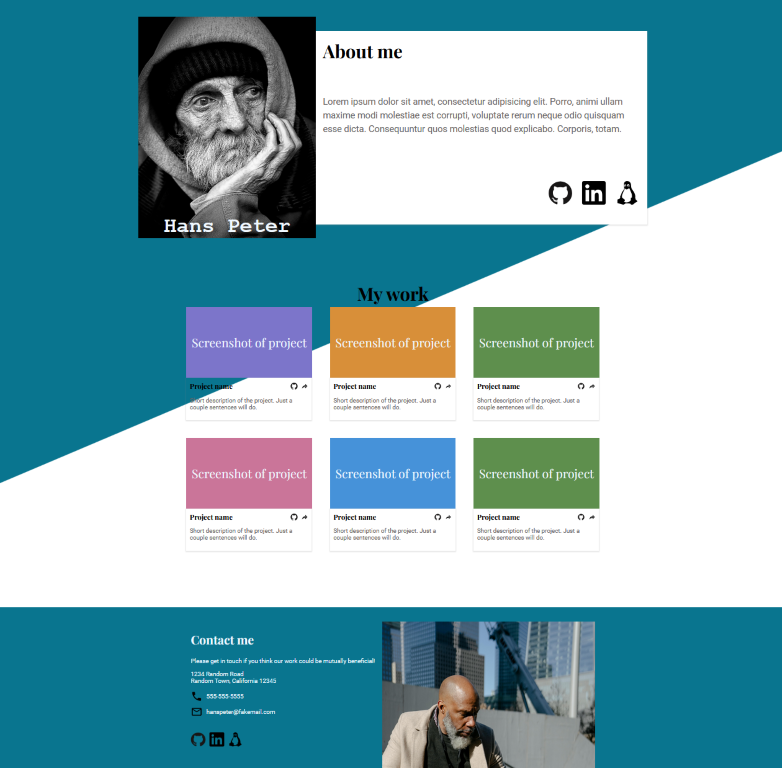

# Homepage

This project uses HTML and CSS. The project delivers a responsive homepage for mobile, tablet and desktop layouts.

## The Odin Project: Lesson Homepage

This project is build according to the specification of the [Homepage lesson](https://www.theodinproject.com/lessons/node-path-advanced-html-and-css-homepage)

## Live website

Access <a href="https://gohan61.github.io/homepage/">Homepage</a>

Note: the browser's developer tools might not give an accurate representation of the mobile view. For accurate representation visit the website on a mobile device.
